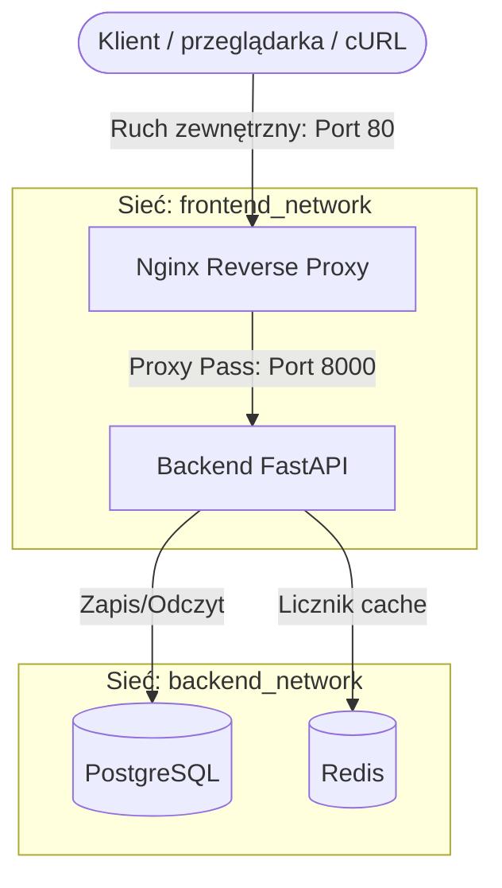

## Diagram Architektury



## 1. Architektura Kontenerowa

System składa się z 4 odizolowanych kontenerów w 2 sieciach, zarządzanych przez Docker Compose:

- **Nginx (Reverse Proxy)**: Port wystawiony na `80`, przekierowuje ruch. W sieci `frontend_network`.
- **Backend (FastAPI)**: Aplikacja Pythonowa, zbudowana przez wieloetapowy `Dockerfile`, działa jako użytkownik `student` (non-root). Łączy sieci front/back.
- **PostgreSQL (Baza danych)**: Baza relacyjna, z Named Volume `postgres_data`. Nie wystawia portów na zewnątrz. W sieci `backend_network`.
- **Redis (Cache/Komponent wspierający)**: Baza in-memory do zliczania dodanych notatek. W sieci `backend_network`.

## 2. Instrukcja Uruchomienia

1. Skopiuj plik z hasłami (symulacja): `cp .env.example .env`
2. Uruchom środowisko w tle:
   ```bash
   docker compose up -d --build
   ```

## 3. Komendy Testowe (Kryteria Akceptacji)

### A. Sprawdzenie mechanizmu Healthcheck (Wymóg API)

```bash
curl.exe -X GET http://localhost/health
curl.exe -X POST -H "Content-Type: application/json" -d "{\"content\": \"Pierwsza notatka\"}" http://localhost/notes
curl.exe -X GET http://localhost/notes
```

Oczekiwane wyniki:
{"status":"OK"}
{"id":1,"message":"Zapisano i policzono w cache"}
{"redis_total_created":1,"postgres_notes":[{"id":1,"content":"Pierwsza notatka"}]}

Test Trwałości Danych

```bash
docker compose down
docker compose up -d
curl.exe -X GET http://localhost/notes
```
